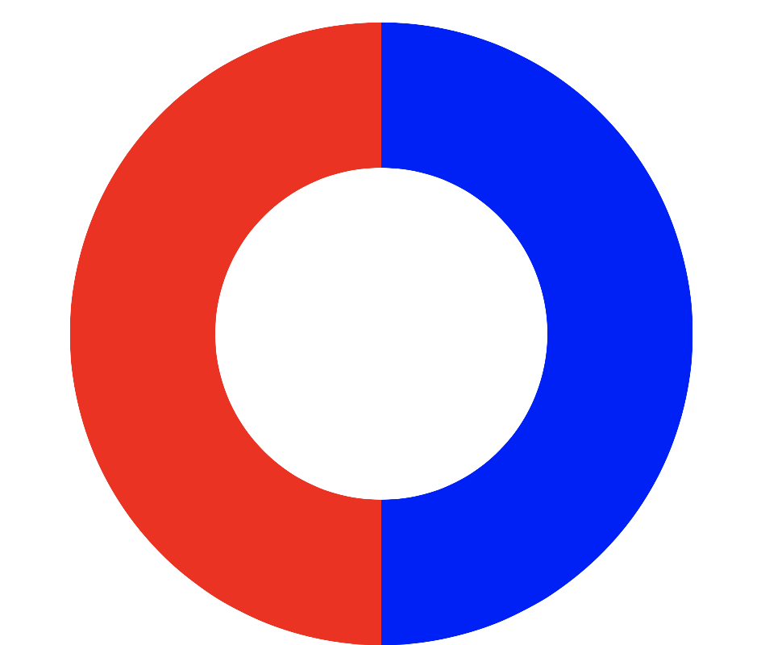
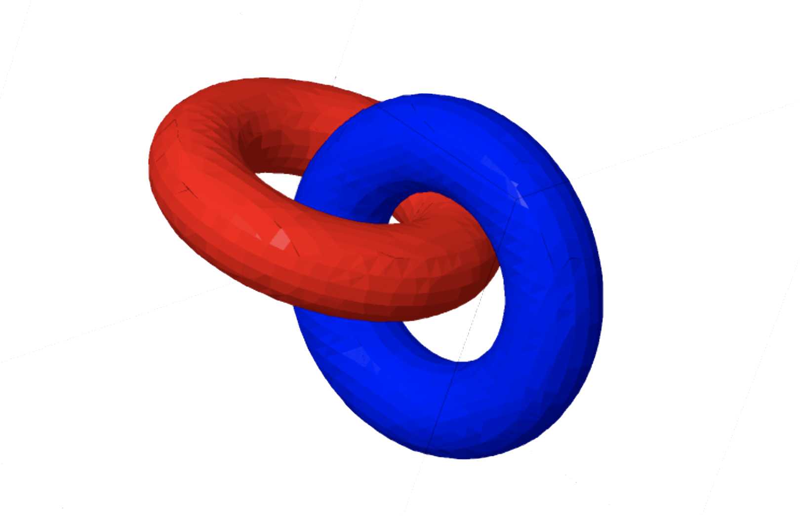
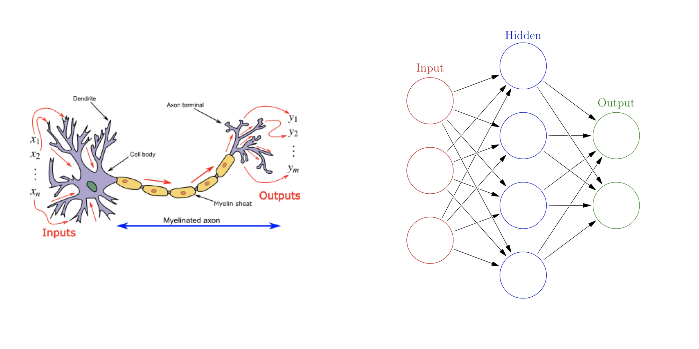

## Why ANNs?

Usually, tree based models are better suited for tabular data than deep learning
algorithms. This can be explained through <a href = "http://colah.github.io/posts/2014-03-NN-Manifolds-Topology/" target="_blank">
Manifold Hypothesis.</a> The idea is that, if the dimensions of the dataset are
just points in an n-dimensional plane, they can be represented in lower dimensions.
Think <a href = "https://mr-hn.github.io/pcaIndex/" target="_blank">Principal Components.</a> If the 
data is donut shaped in the 3-D plane, they can be <i>squeezed</i> into 2-D. Taking a
look at the figure below, one can be sure that a tree model would be able to classify 
it very well.

<center>{width=50%}</center>

However, if the data point are forming `topologies`, like the linked doughnuts
in the figure below, they cannot be <i>bent</i> to lower dimensions. This is
where wide and/or deep neural networks excel, making them extremely popular in
image and text classification.

<center>{width=80%}</center>
<center><font size = -1>Source: <a href ="http://colah.github.io/posts/2014-03-NN-Manifolds-Topology/" target="_blank">colah.github.io</a></font></center>

## The Basics

The easiest way to understand how Artificial Neural Networks function is to 
understand their original inspiration - the biological neurons. They accept inputs,
adjust weights in the hidden layer and estimate the output. 



A single neuron is essentially a linear model. A network of neurons functioning 
together can have significant performance improvement over linear models. By 
chaining neurons, the model gets the ability to map non-linearities in the dataset. 

## Learning Method and Implementations

R has several implementations of neural networks, the most commonly used ones
being `nnet` and `neuralnet`. They both perform similarly, but neuralnet allows 
multiple hidden layers, while nnet allows regularizing weight. To understand what
that means, let's first understand the working of a neural network through a
(2) layer - (h,q) neurons network.

<center></center>
<center><font size = -1>Source: <a href ="https://commons.wikimedia.org/wiki/File:Two_layer_ann.svg" target="_blank">Wiki</a></font></center>

In the figure above, $x_i$ are the input columns passed to the first hidden layer. They 
are added a random weight $w_{ih}$ for each of the $h$ neurons in the layer. There
is also a bias $b_i$. The outputs $z_i$ are then passed as input to the second 
hidden layer with $q$ sets of weights and biases. This step is called
`forward pass` and the outputs $y_i$ are recorded. The recorded outputs are 
compared against the actual value and the error is calculated. The process
repeats again, only this time the weights are adjusted to minimize the error. 
This is called `back propogation`. It repeats until acceptable levels of errors 
are reached.

#### Choosing Neurons and Layers

Higher number of neurons in a layer help capture the non-linearities in the dataset. 
The rule of thumb is to set it at 2/3 the size of the input layer, plus the size 
of the output layer.

Higher number of hidden layers help distinguish increasingly complex features of the
input. Like in the case of image recognition where the objective is to detect
edges, shapes and also objects. However, the usefullness of multiple hidden layers
ends there. For most tabular classification problems, <a href = "https://en.wikipedia.org/wiki/Universal_approximation_theorem"target = "_blank">
Universal Approximation Theorem</a> states that one hidden layer can approximate
any continuous function.

#### Setting Rate and Decay

Apart from the number of layers and neurons, there are two other parameters that
can be controlled in a neural network.

The first is the `learning rate` which controls how fast the model should converge
during backpropogation. A slow learning rate means that the model will take long
to converge, but it won't miss a local minima. On the other hand, a fast slow
learning rate might not converge at all, or even diverge.

The second is the `weight decay`. This is a regularization parameter that's 
added to the $w_i$ estimation that forces weight to be as small as possible.
It's exactly the same as the $\lambda$ in a lasso regression.  

<br>
In this post, we aim to predict bankruptcies through ANNs. Although this isn't
their best use, this post will serve as a tutorial to apply the models on tabular
data and observe performance changes as the hyperparameters are altered. Thus both
the `nnet` and `neuralnet` implementation are employed.

## Required libraries

The following libraries are required to reproduce the output.
```{r message = FALSE, warning = FALSE}
library(tidyverse) #The gas to the caR
library(rsample) #Sampling data into train and test
library(caret) #Classification Tools
library(pROC) #Calculate ROC area
library(plotly) #Interactive plots
library(nnet) #Neural Network - allows regularizing
library(neuralnet) #Neural Network - allows multiple hidden layer
library(knitr) #Generate HTML doc
library(prettydoc) #HTML doc theme
```

```{r echo = FALSE, message = FALSE, warning = FALSE}
opts_chunk$set(message = FALSE,
               warning = FALSE,
               echo = FALSE, 
               out.width = "100%",
               fig.align = "center")

# Data read
data_orig <- read_csv("data/bankruptcy.csv")
colnames(data_orig) <- tolower(colnames(data_orig))

# Data type adjust
data_orig$fyear <- as.factor(data_orig$fyear)
data_orig$cusip <- as.integer(data_orig$cusip)
data <- data_orig[,-c(1, 3)]
```

## Data that we are working with

The bankruptcy dataset that's used in this post contains 10 predictor variables
that point to whether or not an entity went bankrup. The `dlrsn` is the binary
response variable and there are `r nrow(data_orig)` records. The list of variables, 
along with a description and summary statistics are presented below. 

```{r echo = TRUE}
# Data read
data_orig <- read_csv("data/bankruptcy.csv")
```

```{r}
# Print Summary Stats
var_desc <- c("Indicates bankruptcy",
              "Working Capital/Total Asset",
              "Retained Earning/Total Asset",
              "Earning Before Interest & Tax/Total Asset",
              "Market Capital / Total Liability",
              "SALE/Total Asset",
              "Total Liability/Total Asset",
              "Current Asset/Current Liability",
              "Net Income/Total Asset",
              "LOG(Sale)",
              "LOG(Market Cap)")

summary_stats <- summary(data) %>% as.data.frame() %>% 
  separate(Freq, into = c("stat", "value"), sep = ":" ) 
summary_stats$value <- summary_stats$value %>% as.numeric() %>% round(2)

summary_stats <- summary_stats %>% spread(key = stat, value = value) %>%
  mutate(Description = var_desc) %>% 
  dplyr::select(c(2, 9, 8, 5, 6, 7)) %>% rename("Variable" = "Var2")

summary_stats[1,c(5,6)] <- NA
summary_stats %>% kable(caption = "Variable summary statistics")
```

The columns of the data are sclaed to be in a [0 - 1] range before being fed into
a neural network model. Data is split into a 75/25 training and testing sets.

```{r}
#Scaling functions
scale01 <- function(x){
  (x - min(x)) / (max(x) - min(x))
}
data$dlrsn <- as.factor(data$dlrsn)
data_scaled <- data
data_scaled[2:11] <- data_scaled[2:11] %>% sapply(scale01)

# Splitting the data
set.seed(1804)
data_split <- initial_split(data_scaled, prop = .75, strata = "dlrsn")
data_train <- training(data_split)
data_test  <- testing(data_split)
```

## Modeling neuralnet

The neural net model implemented below has one neuron in the first hidden layer
and two in the second layer. This is set through the `hidden` parameter. `stepmax`
is the maximum number of iterations the model is allowed to run. The activation
function to be applied is set to `logistic` and setting `linear.output` to false
indicates that we are running a classification. The actual model with weights
and biases has been printed below.

```{r echo = "show"}
neuralnet_model <- neuralnet::neuralnet(dlrsn ~ ., data = data_train, stepmax = 1e6,
                                        linear.output = FALSE, act.fct = "logistic",
                                        hidden = c(1, 2))
plot(neuralnet_model)
```
The change in model performance for different number of layers and neurons can be 
observed through the increasing AUC in the chart below.

```{r out.width="75%"}
neuralnet_layers <- expand.grid(layers = list(1, 2, 3, 4, 5,
                                              c(1,1), c(1,2), c(2,2)),
                                Training = 0,
                                Testing = 0)

for (i in 1:nrow(neuralnet_layers)) {
  neuralnet_model <- neuralnet::neuralnet(dlrsn ~. , data = data_train, stepmax = 1e6,
                                          linear.output = FALSE, act.fct = "logistic",
                                          hidden = neuralnet_layers$layers[[i]])
  
  neuralnet_predict <- predict(neuralnet_model, data_train)
  neuralnet_predict_oos <- predict(neuralnet_model, data_test)
  
  neuralnet_layers$Training[i] <- round(roc(data_train$dlrsn, 
                                            neuralnet_predict[,2])$auc, 6)
  neuralnet_layers$Testing[i] <- round(roc(data_test$dlrsn, 
                                           neuralnet_predict_oos[,2])$auc, 6)
}

neuralnet_layers %>% gather(key, AUC, -layers) %>% 
  ggplot(aes(x = as.character(layers), y = AUC, fill = key)) + 
  geom_col(position = "dodge") + coord_cartesian(ylim = c(0.8, 0.95)) +
  xlab("Neurons/Layers") + theme_minimal() +
  theme(legend.title = element_blank())
```

The first three models have one layer with one to three neurons. The next three models 
have two layers, with one to two neurons in each layer.

Looking at the results of the testing data, adding neurons seem to help the
performance. But after 3 neurons it seems to deteriorate as the model starts 
overfitting and testing AUC starts going down. With the number of layers, 
as expected, adding more seems to make little difference.

## Modeling nnet

As already discussed, the advantage of `nnet` over neuralnet is that it allows
regularizing weight. This helps avoid overfitting to an extent. Unlike cv.glmnet,
which cross validates and estimates the best $/lambda$, nnet expects a `decay`
value to be passed manually. The initial model below shows the implementation
with three neurons.

```{r echo = "show", eval = FALSE}
set.seed(1804)
nnet_model <- nnet(dlrsn ~. , data_train, size = 3, decay = 0, trace = FALSE)
```

The decay values are set to be between 0 to ~69, in multiples of 1.2 as shown
in the code below.
```{r echo = "show"}
decay <- NULL
decay[1] <- 0
decay[2:101] <- 1e-6 * 1.2^{0:100}
```

For each of the 101 decay values, 5 models are built with neurons between 1 to 5.
Each of the model is 5-fold cross validated on the whole dataset and the average
AUC is calculated. 

```{r}
nnet_tune <- expand.grid(decay = decay,
                         size = c(1, 3, 4, 5, 6),
                         AUC = 0)

# For each decay value/number of neuron
for (i in seq_along(nnet_tune$decay)) {
  
  auc_average <- 0
  # Cross validation
  for (j in 0:4) {
    data_nrow <- data_scaled %>% nrow() 
    data_fifth <- round(data_nrow / 5) 
    begin_row <- j * data_fifth + 1
    end_row <- begin_row + data_fifth - 1
    
    set.seed(1804)
    nnet_model <- nnet(dlrsn ~. , data_scaled[begin_row:end_row,], 
                       size = nnet_tune$size[i], 
                       decay = nnet_tune$decay[i], trace = FALSE)
    nnet_predict <- predict(nnet_model, data_scaled[begin_row:end_row,])
    auc_average <- auc_average + ((roc(data_scaled$dlrsn[begin_row:end_row], 
                                       nnet_predict)$auc) / 5) 
  }
  nnet_tune$AUC[i] <- auc_average
}

nnet_tune$size[nnet_tune$size > 1] <- nnet_tune$size[nnet_tune$size > 1] - 1
nnet_tune %>% plot_ly(type = "scatter", mode = "lines",
                      x = ~decay, y = ~AUC, color = ~as.factor(size)) %>% 
  layout( title = "AUC across different decay values",
          xaxis = list(title = "Decay", type = "log"),
          yaxis = list(title = "AUC"))  %>% 
  config(displayModeBar = F)
```


The reducing performance with increasing regularization is observed in the plot
above. Also evident is the fact that performance increases as the number of neurons
in the hidden layer increase.